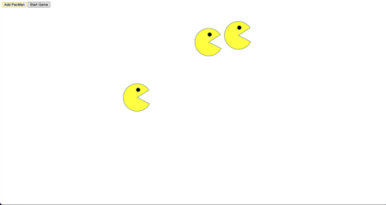

# PacMen Factory Assignment
## Directions: To code the checkCollisions function that would bounce pacmen off the walls of the window & specify pacmen position.

### Description:
-This project uses several functions to create pacmen and start the game at the click of a button.

-Once the game is started the pacmen will begin to move in random directions at a fixed velocity towards the window walls and with help of our functions will bounce around the window indefinitely.

### How to run: 
1. Fork repository
2. Clone repo
3. Drag the index.html file onto your browser.
4. Click button in top left hand corner create pacman to create your pacman and then click start to start the game.
5. Click create pacman multiple times to create numerous pacmen.

### Future Improvements
-In the future I would love to play around with the code to make it more interesting/complex. 
-Maybe adding different color pacmen.
-Styling the css of the buttons and background a little more excitingly.
-And adding a button to increase or decrease the velocity of the pacmens speed.

### License Information
MIT License

Copyright (c) 2020 John Williams

Permission is hereby granted, free of charge, to any person obtaining a copy
of this software and associated documentation files (the "Software"), to deal
in the Software without restriction, including without limitation the rights
to use, copy, modify, merge, publish, distribute, sublicense, and/or sell
copies of the Software, and to permit persons to whom the Software is
furnished to do so, subject to the following conditions:

The above copyright notice and this permission notice shall be included in all
copies or substantial portions of the Software.

THE SOFTWARE IS PROVIDED "AS IS", WITHOUT WARRANTY OF ANY KIND, EXPRESS OR
IMPLIED, INCLUDING BUT NOT LIMITED TO THE WARRANTIES OF MERCHANTABILITY,
FITNESS FOR A PARTICULAR PURPOSE AND NONINFRINGEMENT. IN NO EVENT SHALL THE
AUTHORS OR COPYRIGHT HOLDERS BE LIABLE FOR ANY CLAIM, DAMAGES OR OTHER
LIABILITY, WHETHER IN AN ACTION OF CONTRACT, TORT OR OTHERWISE, ARISING FROM,
OUT OF OR IN CONNECTION WITH THE SOFTWARE OR THE USE OR OTHER DEALINGS IN THE
SOFTWARE.
